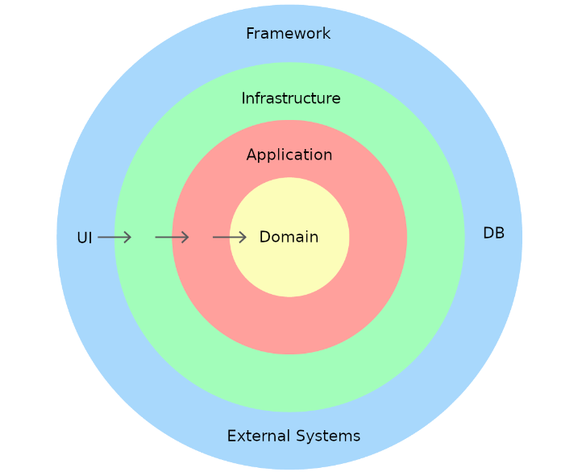
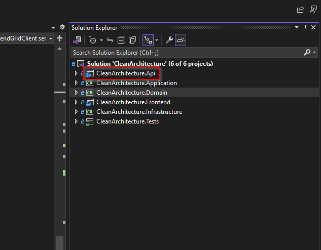
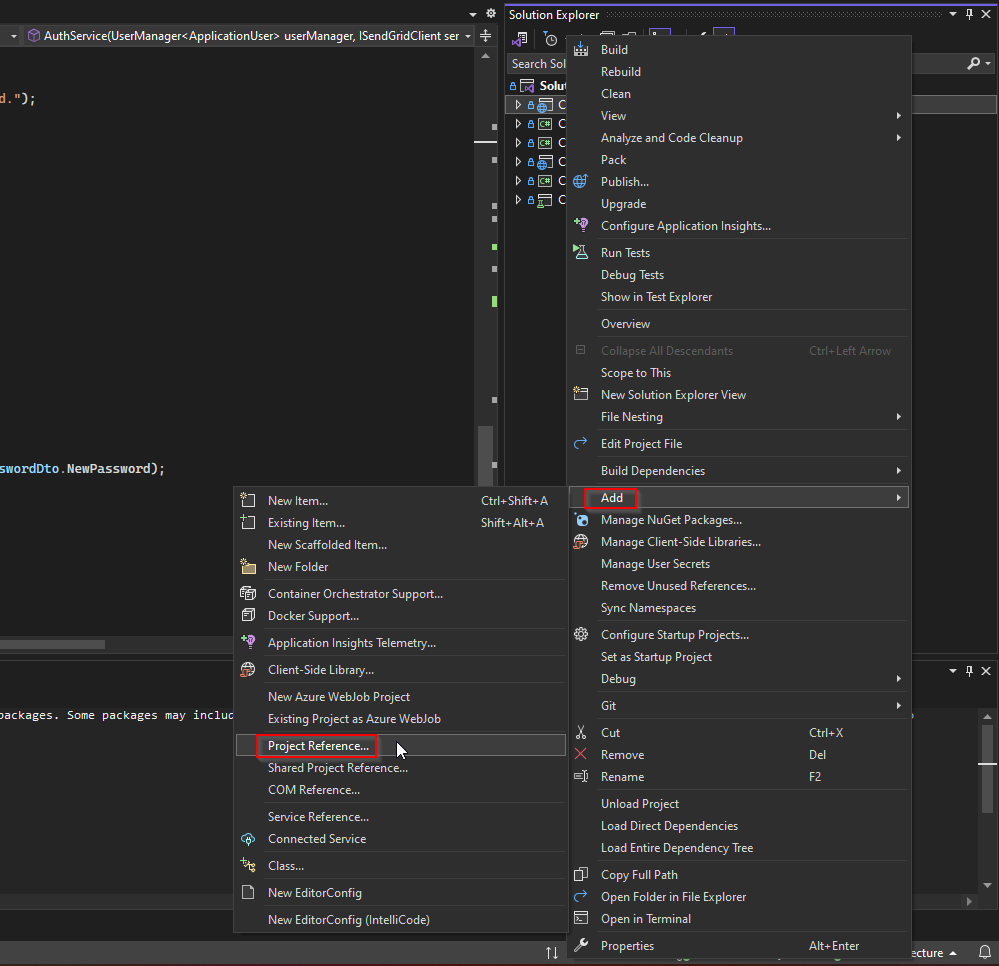
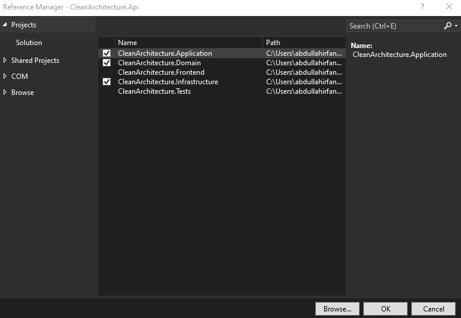

## Why Choose .NET Core in 2024?
Why would you choose .NET Core when you have a billion other frameworks to choose from? You have Django for the Python magic, you have NestJS for it's native support for Javascript. Why do you go out of your way to work on an overly complicated framework based on C#? Well, here's a few reasons why you might have to without wanting to:

- **Client Needs**: .NET framework was widely adopted in legacy systems due to its streamlined coupling with Microsoft Windows while being open-source and cross platform. Thousands of companies have huge code-bases using older versions of .NET which might take years to migrate to frameworks using another language. Clients want to keep their software up-to-date, easy to maintain and powerful but maybe they can't afford to spend years on migration. That's where ASP.NET Core comes in as a modern framework which is easy to migrate to.

- **Strong Community**: ASP.NET Core, without a doubt, probably has one of the largest and unstoppable communities in the world. From Stack Overflow to LinkedIn articles, everyone talks about it and loves it. Any question asked will probably be responded to within a matter of minutes or at max, hours! Who doesn't want this kind of efficiency during intense coding sessions and large-scale projects? I know I do!

- **Power**: Being a an open-source framework with 1200+ active contributors, everything is at your disposal. Want third-party integration with OpenAI? It's there. Want to develop a cloud-first application on Microsoft Azure? You're already there if your'e using .NET Core. With [Minimal APIs](https://learn.microsoft.com/en-us/aspnet/core/fundamentals/minimal-apis/overview?view=aspnetcore-8.0), you have the power to create a quick, lightweight REST API just like you would on Flask or FastAPI, but all Object-Oriented Programming principles are also there. With 300,000+ [Nuget Packages](https://learn.microsoft.com/en-us/nuget/what-is-nuget), you can do anything from background jobs to full-blown scalable web applications. 

Now that we've got that sorted out, let's dive into my roadmap for .NET 8 Core. 

## Why Do We Need a Roadmap?
You might not need it 🤷‍♂️. I for one, struggled a lot when I was requested to start my training with .NET. Even though the community is huge, there is immense confusion between the "Pre .NET 6" way of doing things and how they are done in .NET 8. Not to mention that 90% of community support is for MVC and not Web APIs. With a week behind schedule and having nothing to show to my supervisor, I was not only panicking but also feeling like a failure. That's where my inner voice knocked some sense into me, saying: 

> Come on! You've never worked with C# in your entire life! This was bound to happen. You just need some time and you'll do good. 

With requirements like "Follow SOLID principles", "Identity Framework" and "Use Clean Architecture", I wasn't convinced at all but I had no option but to pull myself together and produce some actual results.

With no single tutorial to follow and experience with Google Dorking, I set off on a journey to learn the .NET Core framework as a total noob.

## Roadmap
- [Dependency Injection](#dependency-injection)
- [Clean Architecture](#clean-architecture)
- [Repository Pattern](#repository-pattern)
- [Entity Framework Core](#entity-framework-core)
- [Creating a Controller](#creating-a-controller)

### Dependency Injection 
> "In software engineering, dependency injection is a programming technique in which an object or function receives other objects or functions that it requires, as opposed to creating them internally. Dependency injection aims to separate the concerns of constructing objects and using them, leading to loosely coupled programs." 

This is the Wikipedia definition for [Dependency Injection](https://en.wikipedia.org/wiki/Dependency_injection). But what is it really? Basically, a particular service is initialized globally and "injected" into any service dependant on it. This pattern leads to looser coupling between the two services which, in turn, improves readability and maintainability. Dependency injection will be more clear in the [Respository Pattern](#repository-pattern) section of our roadmap.

### Clean Architecture


If you're new to .NET development, you might have seen this diagram somewhere. Don't worry if it gets confusing because it's really not. The .NET way of following the "Separation of Concerns" principle is not to create separate folders but to create separate projects entirely. I know, it's confusing and you might be thinking "What??? 🤬". But hey, it's really not as complicated as it sounds. At the end of your initial project setup, you'll be able to navigate through those projects as though they are folders. For that, however, I'll need your attention for a few basic principles: 

- Inner layers MAY NOT access outer layers directly

Wait? Is that it? Well, yes for the most part. But let's dive into how Clean Architecture actually separates concerns. 

- **Domain Layer**: This layer contains your entities and your common objects such as enumerators, global constants and global helpers. 

- **Application**: This layer contains 99% of your application's business logic. What's the basic flow of your application? What Data-transfer Objects (DTO) should be used? How should the application behave in a certain function? 

- **Infrastructure**: This layer contains third-party integration, database integration and related logic. 

- **Framework**: Finally, the outermost layer is the layer closest to your client. In short, this layer will contain your controllers, web APIs, etc.

As for the initial project setup, each of these layers will be a separate "project" within a single "solution". How do we bind these layers together? Let's get to that now. 

### Repository Pattern
Any large-scale web application will follow the repository pattern and .NET Core applications are no exception. Each module in your application should have the following separate objects:

- **Entity**: Defines what that particular module will store. This object becomes a necessity for modules that store data to a database and allows us to define rules, and validation logic for each storable object.

- **Repository**: Defines low-level functions to interact directly with a database/storage mechanism. These functions act as wrappers to be used in services. 

- **Service**: Defines high-level functions to take care of the business logic of your application. Services mostly use repositories and don't interact directly with databases. 

- **Controller**: Defines API endpoints for our web application. Controllers use services to initiate or direct a certain portion of our business logic. 

If you couldn't guess, 

- Entities belong in "**Domain**",
- Repositories belong in "**Infrastructure**",
- Services belong in "**Application**" and 
- Controllers belong in "**Framework**"

I used the word "use" in the above definitions. How does each object use another? This is where Dependency Injection comes into play. First, you have to provide add inner-layer projects to each outer-layer project's references. To do that, we can do the following:

- Right click on your project in the "Solution Explorer"<br/>
    

- Navigate to `Add > Project Reference`<br/>
    

- Tick all inner-layer projects<br/>
    

Finally, repeat this process for each outer-layer project.

Once this is done, you will be able to access all classes, functions, constants etc. of inner projects from an outer project. However, we still need to inject instances of each object that we want to use. To inject dependencies, we need an interface and an implementation. Think of an interface as a definition and the implementation as the actual logic. 

I'll give you a basic project structure to get you started with a basic "Company Controller":

```
|_ Project.Domain
| |_Entities
|   |_Company.cs
|
|_ Project.Infrastructure
| |_Repositories
| |  |_CompanyRepository.cs
| |_DependencyInjection.cs
|
|_ Project.Application
| |_Repositories
| |  |_ICompanyRepository.cs
| |_Contracts
| |  |_ICompanyService.cs
| |  |_CompanyService.cs
| |_DependencyInjection.cs
|
|_ Project.Framework
 |_Controllers
 |  |_CompanyController.cs
 |_Program.cs 
```

In short, you need to define function prototypes in each interface (Files starting with 'I') and you can implement them in each class. You might be wondering why the Repository Interface is in "Application" and the actual implementation is in "Infrastructure". This is because repositories are used on the application layer but since the application layer can not directly access the database, the "wrappers" need to be implemented in the infrastructure layer. Now that we have our project set up, we can start injecting services. 

There are 3 [Service Lifetimes](https://endjin.com/blog/2022/09/service-lifetimes-in-aspnet-core) in .NET Core. Here is how we can use `AddTransient` to inject our repository and service in our DI container: 

```C#
// Project.Application/DependencyInjection.cs

...
public static IServiceCollection InjectServices(this IServiceCollection services){
    services.AddTransient<ICompanyRepository, CompanyRepository>();
    services.AddTransient<ICompanyService, CompanyService>();
}
...
```

```C#
// Project.Framework/Program.cs

...
builder.Services.InjectServices();
...
```

```C#
// Project.Application/Repositories/ICompanyRepository.cs

public interface ICompanyRepository {
    void AddCompany(string name);
}
```

That's it! Now you can use your repository in your service through constructor dependency injection. All you have to do in your service is:

```C#
// Project.Application/Contracts/CompanyService.cs

public class CompanyService: ICompanyService {
    private readonly ICompanyRepository _companyRepository; //declaring a pointer to the repository

    public CompanyService(ICompanyRepository companyRepository) {
        _companyRepository = companyRepository;
    }

    public void SampleUse(string name) {
        _companyRepository.AddCompany(name);
    }
}
```

### Entity Framework Core
Of course, as good modern-day developers, we don't want to spend time on manually creating and updating tables so we follow a code-first approach. For this we use frameworks called Object-Relational Mappings (ORM). ORMs are frameworks which take care of everything from database design implementation to querying the database. No more SQLi because you'll never be writing a raw SQL query ever again! Although other ORMs exist or .NET Core, the most popular and trusted ORM is [Entity Framework Core](https://learn.microsoft.com/en-us/ef/core/). Let me give you an example: 

Instead of writing `db.ExecuteNonQuery("SELECT * FROM companies;")`, you can just write `db.Companies`. This is because EFCore gives you all the low-level querying functions pre-built. Not only that, but you can combine [LINQ](https://learn.microsoft.com/en-us/dotnet/csharp/linq/) with EFCore to get the SQL feel without actually writing any SQL. eg. 

```C#
from company in companies
select company;
```

I will not be getting into the entire API reference provided by EFCore but I will tell you how to get started with it.

#### Setup 
To set up EF Core, we need an entity, a "Database Context" and dependency injection.

```C#
// Project.Domain/Entities/Company.cs

public class Company {
    [Unique]
    public string Id {get;set;} 

    [Required]
    public required string Name {get;set;}
}
```

```C#
// Project.Infrastructure/ApplicationDbContext.cs

public class ApplicationDbContext: DbContext {
    public DbSet<Company> Companies {get; set;}
}
```

```json
// Project.Framework/appsettings.json

"ConnectionStrings":{
    "DefaultConnection": "<YOUR DATABASE CONNECTION STRING HERE>"
}
```

```C#
// Project.Infrastructure/DependencyInjection.cs

...
public static IServiceCollection InjectDatabase(this IServiceCollection services, IConfiguration configuration) {
    services.AddDbContext<ApplicationDbContext>(options => options.UseSqlServer (configuration.GetConnectionString("DefaultConnection"), b => b.MigrationsAssembly  (typeof(ApplicationDbContext).Assembly.FullName)), ServiceLifetime.Transient
    );
}
...
```

```C#
// Project.Framework/Program.cs

...
builder.Services.InjectDatabase(builder.Configuration);
...
```

#### Database Setup

Now that we have set up our codebase, it's time to set up the database. Don't worry, you won't have to do that manually. Just open up your "Package Manager Console" in Visual Studio and run the following commands:

```powershell
Add-Migration IntialMigration
Update-Database
```

Congratulations! Your database will now have a "Company" table with attributes matching the ones you have set up in your entity. 

#### Implementing a Repository

We have everything setup and now it's time to implement our Company Repository.

```C#
// Program.Infrastructure/Repositories/CompanyRepository.cs

public class CompanyRepository: ICompanyRepository {
    private readonly ApplicationDbContext _db;

    public CompanyRepository(ApplicationDbContext db){
        _db = db;
    }

    public async void AddCompany(string name) {
        var company = new Company { Name = name };

        await _db.Companies.AddAsync(company);
        await _db.SaveChangesAsync();
    }
}
```

### Creating a Controller
You might be wondering where our REST API is. Don't worry, I will show you how to do that as well. Let's create a CompanyController now!

```C#
// Project.Framework/Controllers/CompanyController.cs

[Route("api/[controller]")]
[ApiController]
public class CompanyController: ControllerBase {
    private readonly ICompanyService _companyService;

    public CompanyController(ICompanyService companyService) {
        _companyService = companyService;
    }

    [HttpGet]
    public async IActionResult GetCompanies(){
        throw new NotImplementedException();
    }

    [HttpGet("{id}")]
    public async IActionResult GetCompany([FromRoute] string id) {
        throw new NotImplementedException();
    }

    [HttpPost]
    public async IActionResult CreateCompany([FromBody] string name) {
        return Created(await _companyService.SampleUse(name));
    }

    [HttpPut]
    public async IActionResult UpdateCompany(
        [FromRoute] string id
        [FromBody] string name
    ) {
        throw new NotImplementedException();
    }

    [HttpDelete]
    public async IActionResult DeleteCompany([FromRoute] string id) {
        throw new NotImplementedException();
    }
}
```

.NET Core provides annotations for all HTTP verbs and also provides an `IActionResult` datatype to return HTTP status codes along with corresponding data. You can follow [this](https://learn.microsoft.com/en-us/aspnet/core/tutorials/first-web-api?view=aspnetcore-8.0&tabs=visual-studio) tutorial to learn more about the functionality provided in ASP.NET Core controllers.

### Next Steps
While the above is enough to get you a basic understanding of API development with .NET 8, following the good practices, it is definitely not a complete course on backend development. The learning for backend development never stops with its ever-growing nature. However, here are the next steps I took to get through my training: 

- Introduction to [Identity](https://learn.microsoft.com/en-us/aspnet/core/security/authentication/identity?view=aspnetcore-8.0&tabs=visual-studio) Framework 
- Authentication and Authorization
- [Global Exception Handling](https://www.milanjovanovic.tech/blog/global-error-handling-in-aspnetcore-8) and Logging 
- Unit and Integration Testing
- Background Jobs with [Hangfire](https://jayanttripathy.com/hangfire-with-asp-net-core-7/)

## Conclusion
While I may not have become a pro at .NET Core, I hope my blog helps all my fellow newcomers to have an easier transition to .NET Core development!

